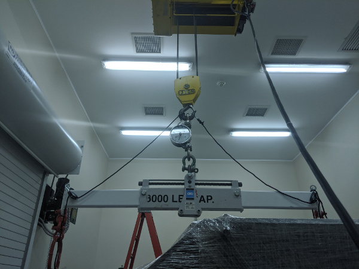
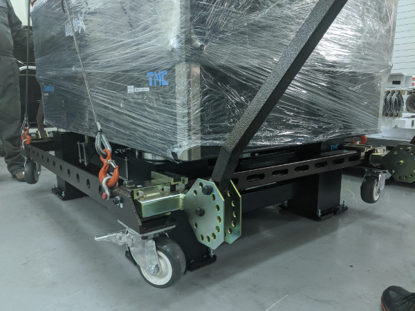
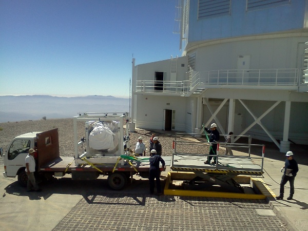
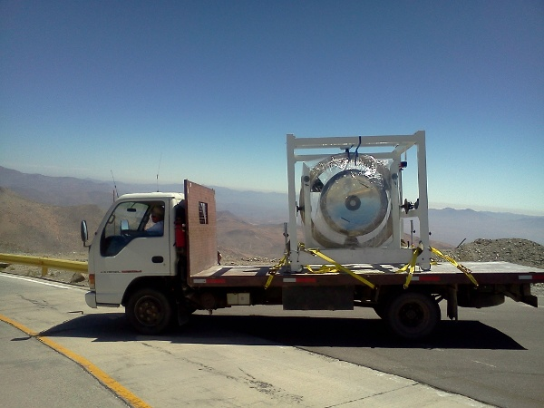
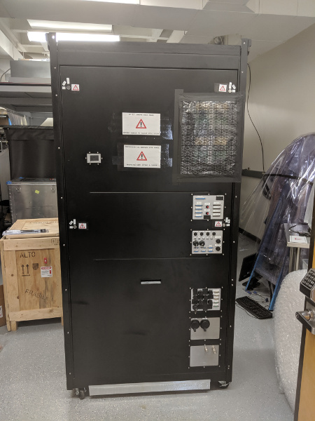
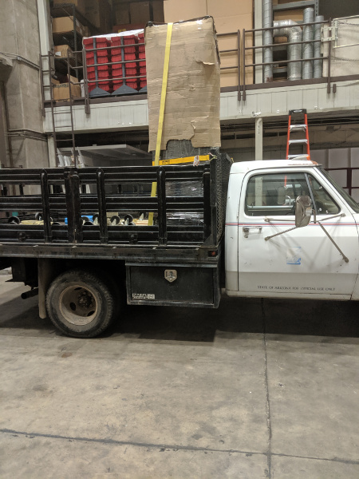

# Removing MagAO-X from the Telescope

This procedure describes how to remove the MagAO-X instrument on the Magellan Clay Telescope.

Estimated Time to Complete: 2 hours

```eval_rst
This document can be downloaded as a PDF: :static:`Removing MagAO-X from the Telescope <handling/telescope_removal.pdf>`
```

## Initial Conditions

- [ ] Instrument on Magellan Clay Nasmyth Platform, operating.

## Preparations

- [ ] Shutdown MagAO-X

- [ ] Turn off table legs and remove air connection

- [ ] Remove all cables
  - See detailed procedure for removing 2K DM cables

- [ ] Electronics Rack
  + [ ] Ensure that roll-out shelves are restrained
  + [ ] Close and lock doors
  + [ ] Tape keys down

- [ ] Instrument
  + [ ] Remove eyepiece
  + [ ] Remove bumpers and pusher hardware
  + [ ] Turn off blower, and remove hose
  + [ ] Tape over any exposed holes (from cables, etc)
  + [ ] Secure any loose cables
  + [ ] Shrink wrap the instrument
  + [ ] Install solar blanked over shrink wrap

- [ ] Cart and Rigging
  + [ ] Verify all cart hardware is in-hand
  + [ ] Verify two wire harnesses are in hand
  + [ ] Partially assemble cart, leaving one long side off
  + [ ] Store cart out of the way so table can roll into unpacking area

## Rig Onto Cart

- [ ] Position the telescope so that the elevator has access to the NASE platform

- [ ] Lower table legs onto the casters by turning the 16 leveling bolts, and remove the metal pads

- [ ] Roll the instrument away from the telescope

    **NOTE:** At least 4 people required, 2 to push, 2 to hold the cleanroom sides open

- [ ] Move the cart, currently with 3 sides, around the legs

    - **CAUTION:** be careful to not bump the legs with the cart

- [ ] Attach the 4th side of the cart

- [ ] Ensure that the 8 large bolts on the cart are snug but not tight

- [ ] Attach the lifting wire-harness to each side of the cart

- [ ] Attach the load spreader with straight extensions to the crane, using a crane scale

    

    *The load spreader attached to the crane for lifting the cart*

- [ ] Place the load spreader in the center position (the cart is symmetric)

- [ ] Lift the load spreader, and position it over the instrument

- [ ] Being careful to not bump the instrument, lower the load spreader and attach the lifting harness D rings.  Use 2x shackles to extend the length to reach the cart on the floor.

    

    *Lifting harnesses attached with shackle extensions*

- [ ] Position a person at each corner of the cart

  **CAUTION:**  Do not allow the cart to bump the legs or the table uncontrolled

- [ ] Slowly lift the cart (**320 lbs**) until it is touching the bottom of the table

    

    *The cart being lifted to the bottom of the table.*

- [ ] Install the 8 bolts attaching the cart to the table.  Loosen bolts on the cart as needed.

- [ ] Once the cart is bolted to the table bottom, while **320 lbs** is still on the crane, tighten all cart bolts.  Do not over-tighten, make 1/4 turn after the washers are no longer free.  This is to avoid excessive stress on the table.

- [ ] Install the triangle stabilizing ropes between the crane hook and the lifting fixture IAW the below figure.  Tighten, but do not cause them to pick the load.

    

    *The triangle stabilizing ropes should be tight, but not become the lifting point for the load.*

    **CAUTION:** be sure that the load spread does not hit the cart when being repositioned.

- [ ] Reposition the load spreader center to the instrument + cart position marked on it.

- [ ] Ensure that there is room to move the legs out from under the table, opening the garage door into the cleanroom if necessary.

- [ ] Position a person at each corner of the cart to stabilize it during the lift.

- [ ] Position two people to remove the legs from under the table

- [ ] Lift the table off the legs.  The weight of the table + cart is **1920 lbs**

- [ ] Move the legs out from under the table.

    

    *The cart and instrument ready to be set down on the wheels, with legs out of the way.*

- [ ] Set the cart down on its wheels.

- [ ] Move MagAO-X onto the elevator, and remove from the dome

- [ ] When cart is on concrete outside Clay, move very slowly to avoid excessive vibration

## Transport MagAO-X To The Clean room

- [ ] Ensure that the lift gate at the summit has been adjusted for slow smooth operation as is done for the asm

- [ ] Push MagAO-X onto the lift-gate

- [ ] Raise the lift-gate to the height of the flatbed truck

- [ ] Move MagAO-X onto the truck, using the come-along

    

    *MagAO-X will be loaded at the telescope using the lift gate, adjusted for slow operation as it is for the ASM.*

- [ ] Secure the instrument by strapping the cart down at 4 points as illustrated in the below figure.

    

    *MagAO-X will be strapped to the Isuzu similarly to how the ASM is transported.*

- [ ] Slowly drive the truck to the cleanroom

- [ ] Back the flatbed truck up to the lift gate.

- [ ] Next, using the come-along, carefully move MagAO-X onto the lift gate.

- [ ] If the legs were not moved, return to the  with the flatbed and move the legs to the telescope.

## Install MagAO-X On The Platform

## Transport Electronics

- [ ] remove the earthquake bar

- [ ] Move the rack to the lift gate, and load it on the pickup.

- [ ] place foam between the rack side and the truck to protect cable connectors

    

    *The electronics rack has many delicate connectors on the side.*

- [ ] strap the rack securely to the truck

    

    *The rack on a truck for transport.*

- [ ] drive the truck to the cleanroom

- [ ] unload the rack using the lift gate


## Remove AOC from Control Room

- [ ] power down AOC

- [ ] remove monitors and pack

- [ ] move AOC to cleanroom.

