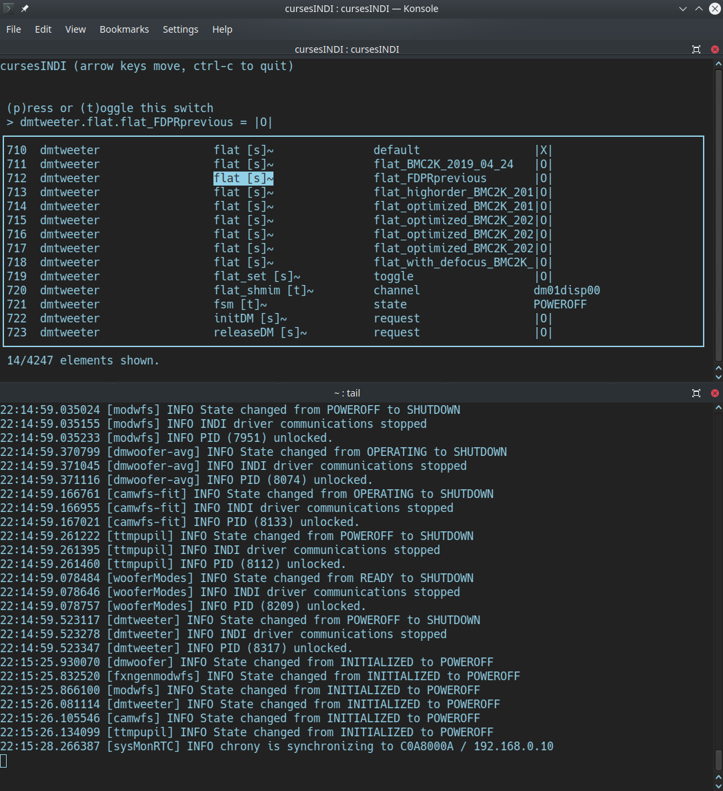

# cursesINDI

The instrument interface of first and last resort.

The `cursesINDI` tool is available on all MagAO-X computers (including VMs and the test bed) and enables viewing and manipulation of the instrument settings via low-level properties and the INDI protocol. It can be useful when adding new drivers to the system, or when trying to track down a strange behavior in a higher-level GUI interface.

You do not need to be `xsup` to run `cursesINDI`, but you do need `localhost:7624` to connect to a local or remote indiserver. This is the case when SSHed in to AOC, RTC, ICC, or the testbed (TCC); otherwise, you can use SSH tunneling.

## Overview

Start cursesINDI from a terminal with the `cursesINDI` command.



The terminal will blank and show something like the top pane in the screenshot above. Note: that you may need to resize your terminal to see all five columns:

  - index
  - device name
  - property name (and meta info, see below)
  - element name (see conventions below)
  - value

By default, you're in "search" mode. Start typing a device name and cursesINDI will scroll the list to bring that device into view. Right-arrow over to the value column, and the `search:` prompt will change to `(e)dit this number`. Hit the `e` key and you'll be prompted to `set devname.propname.element=`. Type in your new value, hit `enter`, and confirm (after checking carefully) the new value with `y`. (Or, you can hit `Esc` to get out of setting the value.)  

Note that many properties are read-only, and you will not be offered to edit them if so.

`cursesINDI` also shows you the current value of the element you have selected as `set devname.propname.element = <value>`.  Text and numbers are displayed as transmitted by INDI.  Switches use `|O|` for off and `|X|` for on.

## Property meta info

The bracketed letter indicates whether a property is a `[t]ext`, `[n]umber`, `[s]witch`, or `[l]ight` as defined by INDI. The character after the brackets can be `~` (Idle), `-` (Ok), `*` (Busy), or `!` (Alert). You'll see Idle properties switch to Busy when you set them, and back to Idle once the state you've set has been reached.

## Element naming convention

In the MagAO-X instrument, the convention is for settable properties to expose their `current` value and their `target` value as two elements of the property. This is useful to, e.g., command stages and compare their current location to their commanded one. (Thanks to limitations in INDI, "read-only" can only apply to properties, not elements. Functionally, `current` is read-only and all edits are to `target`.)

## Process Logs

All process logs for INDI-connected MagAO-X applications are streamed to INDI clients.  `cursesINDI` writes these as they are received to the file `/tmp/cursesINDI_logs.txt`.  You can monitor these logs in real-time with the command
```
$ tail -f /tmp/cursesINDI_logs.txt
```
The result is shown in the bottom pane of the above screenshot.  Most terminal programs allow you to split the screen, making for a nice combined system control panel with the logs on the bottom.  The image above shows this.

The `cursesINDI` log file will only contain up to 1000 entries, at which point is emptied and restarted.  For more detailed inspection of a processes history you must use the `logdump` utility.
