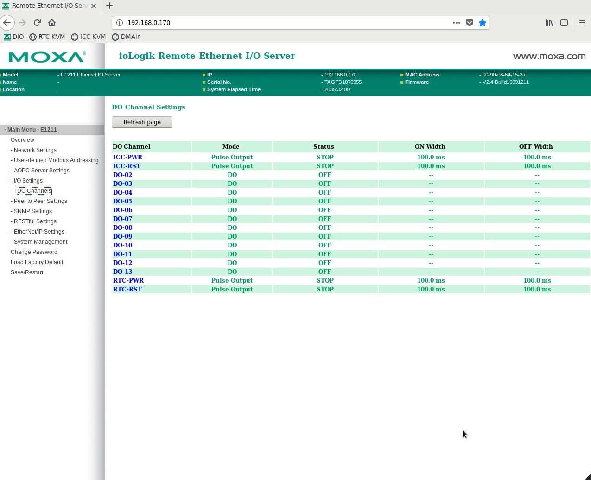
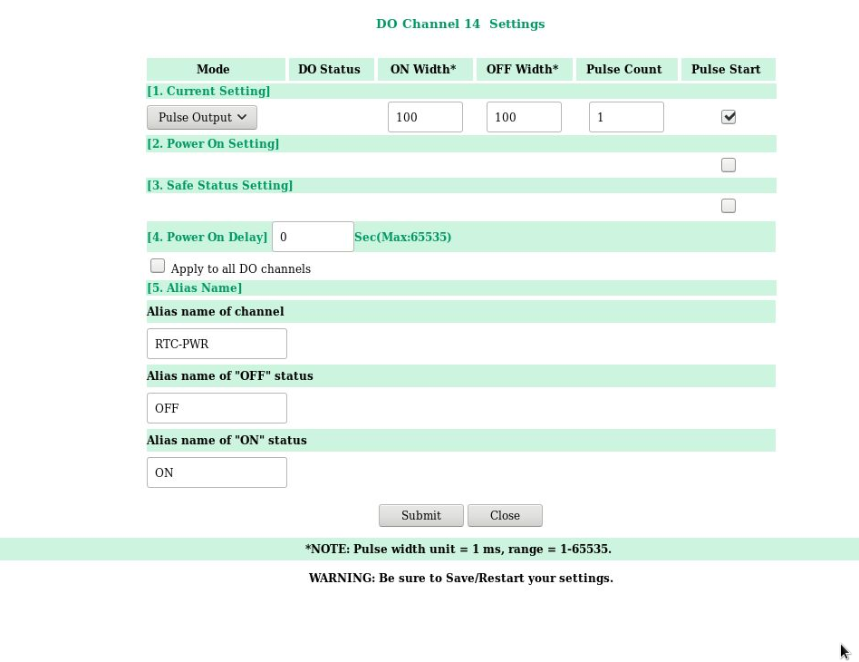
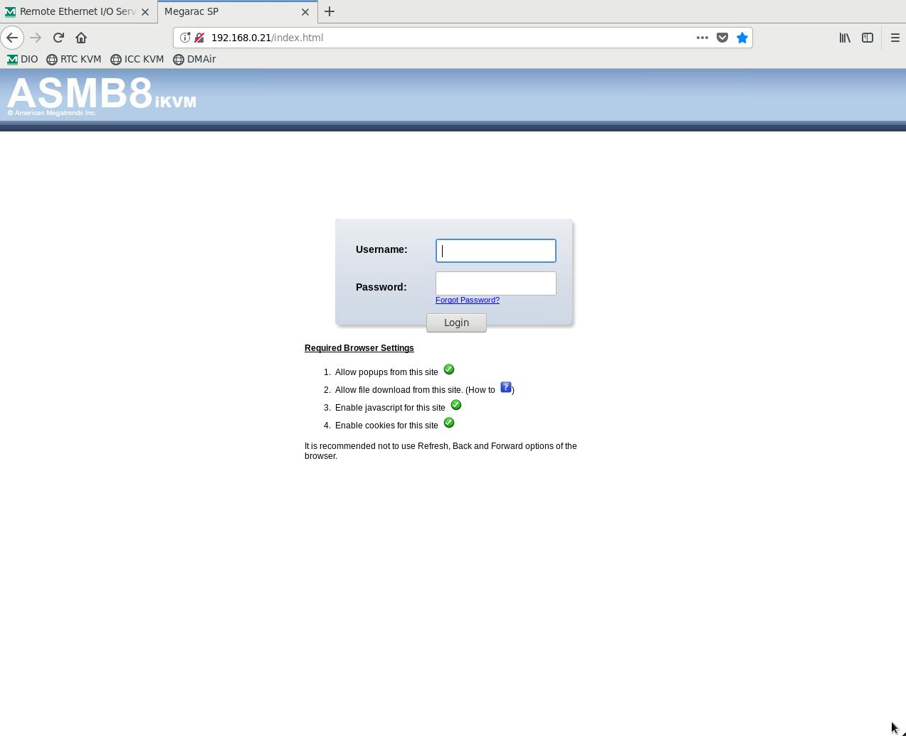
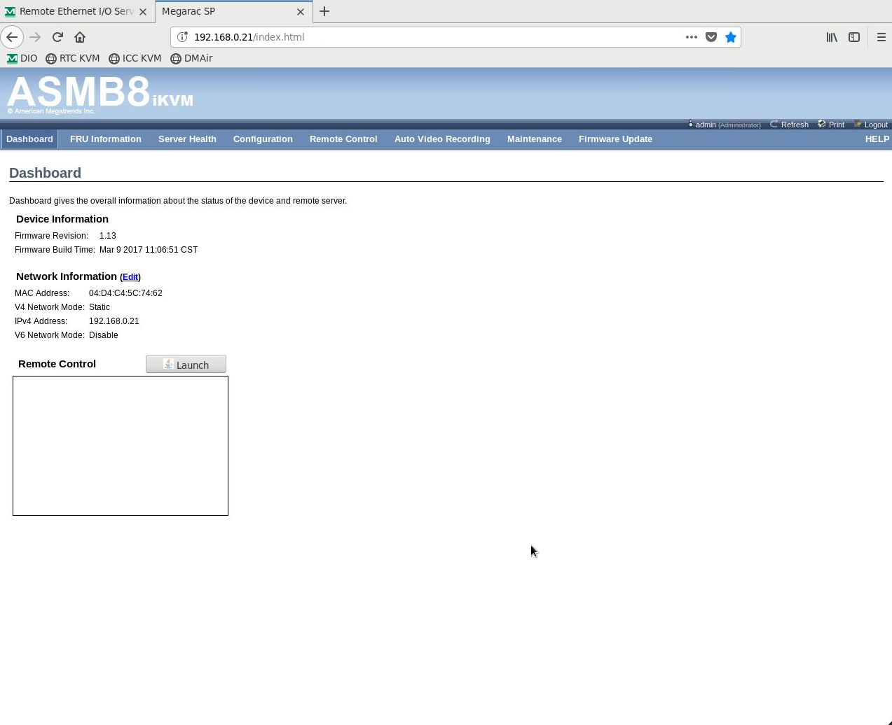
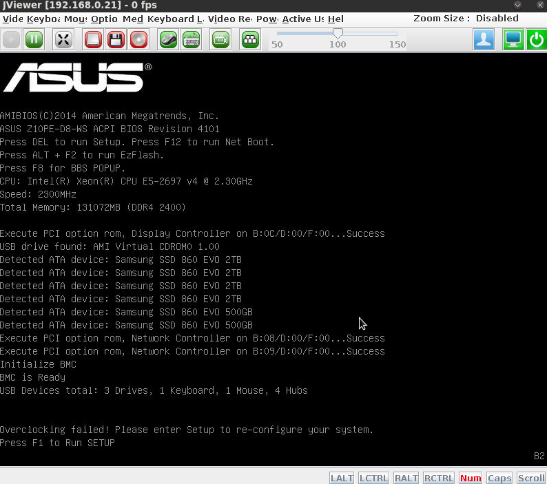
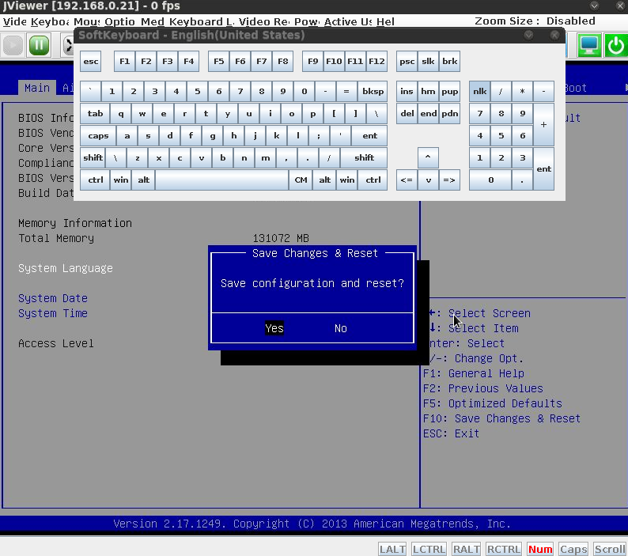

# Startup

Once the instrument has been unpacked and cabled, begin startup from System Powerup. Subsequent (nightly/daily) re-startup should generally begin from "Preparing For Operation" below.

The following assumes you're sitting at the AOC workstation, but it could be done anywhere with appropriate network tunnels. When one must SSH to different hosts, the one where the command should be run will be indicated before the prompt, like `[xsup@exao1 ~]$ ls` to run `ls` on AOC in the `~` directory. (Don't type the `[host $]` prompt, or any comment lines starting with `#`.)

You should run these commands as the user `xsup` to ensure you can read shared memory images (shmims) and `ssh` around to RTC and ICC.  If sitting at AOC, it's therefore best to be logged into the desktop as `xsup`.

If working remotely, note that steps in RTC and ICC power-up must be done from firefox running on AOC.  You can use `ssh -X` to accomplish this with the right command line option in firefox, but using the x2go virtual desktop is generally easier.

## System Powerup

1. Start the MagAO-X processes on AOC (exao1) to get power control (see the [guide to xctrl](./software/utils/xctrl) for more detail)

    ```
    [[xsup@exao1 ~]$ xctrl startup
    # you'll see some output as the processes start, wait a little bit
    [[xsup@exao1 ~]$ xctrl status
    # verify processes are all green/running
    ```

2. You should have power control now. AOC talks over the instrument internal LAN to network-controlled power strips (PDUs), which you can control over INDI via several different interfaces: `sup`, `cursesINDI`, or `pwrGUI`.

    Since you're sitting at AOC, it's simplest to open `pwrGUI`. You should see switches appear.

    ```
    [[xsup@exao1 ~]$ pwrGUI &
    # window should pop open with switches
    ```

3. The following devices should be powered up, and never powered off (unless you know what you're doing):

    - swinst
    - dcpwr
    - blower
    - fan1
    - fan2
    - instcool

4. RTC Power-On <a name="rtc_power_on"></a>
    1. **IMPORTANT** ensure that instcool is powered on to provide liquid cooling to the RTC.
    2. using the pwrGUI, power on `comprtc`
    3. wait at least 90 sec to allow the motherboard KVM module to initialize
    4. open firefox, and navigate to `192.168.0.170`: <a name="rtc_power_on44"></a>
    5. login (if required, password provided to those who need it)
    6. in the left menu, select `I/O Setting -> DO Channels`
      
    7. in the main frame, click on `RTC-PWR`, which will open a new window:
      
    8. Under [1. Current Setting], ensure that `Pulse Output` is selected, and check the box under Pulse Start.  Then press the `Submit` button at the bottom.  This remotely presses the ATX power button on the RTC.
    9. Next open a new tab in firefox, and navigate to 192.168.0.21, and login (password provided to those who need it):
      
    10. Press the `Launch` button after Remote Control:
      
    11. This brings up a video display of the RTC VGA output. Use the display to monitor progress.  It will likely hang with a message to press F1 as shown:
      
    12. This message is meaningless. When this message appears, press F1. Do NOT alter any settings. Immediately press F10 (Save Changes and Reset) and hit enter to say Yes.  A soft keyboard can be brought up from the dispaly controls to facilitate these interactions:
      
    13. Once the boot finishes, use `nvidia-smi` to be sure all GPUs are visible (currently 3 on RTC, 1 on ICC).
    14. If a GPU has `fallen off the bus`, see the troubleshooting guide for steps to take.
    
5. ICC Power-On
    1. **IMPORTANT** ensure that instcool is powered on to provide liquid cooling to the ICC.
    2. using the pwrGUI, power on `compicc`
    3. wait at least 90 sec to allow the motherboard KVM module to initialize
    4. open firefox, and navigate to 192.168.0.170
    5. login (if required, password provided to those who need it)
    6. in the left menu, select `I/O Setting -> DO Channels`
    7. in the main frame, click on `ICC-PWR`, which will open a new window
    8. under 1. Current Setting, ensure that `Pulse Output` is selected, and check the box under Pulse Start.  Then press the `Submit` button at the bottom. This remotely presses the ATX power button on the ICC.
    9. Next open a new tab in firefox, and navigate to 192.168.0.22, and login (password provided to those who need it)
    10. Press the `Launch` button after Remote Control.  This brings up a video display of the ICC VGA output.
    11. Use the display to monitor progress.  ICC should progress to the loging prompt without incident.

## Software Startup

1. RTC
   - ssh to RTC with `ssh rtc`
   - First start cacao `dmcomb` processes.  Woofer first, then tweeter.  Note that these startup scripts are located in xsup's home directory.
   
     ```
     [xsup@exao2 ~]$ bash ./cacao_startup_woofer.sh
     [xsup@exao2 ~]$ bash ./cacao_startup_tweeter.sh
     ```
   - Use fpsCTRL to verify that both dmcombs are running:
   - Now start MagAO-X
     ```
     [xsup@exao2 ~]$ xctrl startup
     ```
   - Use `xctrl status` to verify that processes have started.
   
3. ICC
   - ssh to ICC with `ssh icc`
   - First start cacao `dmcomb` processes for the dmncpc.  Note that these startup scripts are located in xsup's home directory.
   
     ```
     [xsup@exao3 ~]$ cd /opt/MagAOX/cacao/working/ncpc_mwfs
     [xsup@exao3 ncpc_mwfs]$ source cacaovars.ncpc_mwfs.bash
     [xsup@exao3 ncpc_mwfs]$ cacao-setup ncpc_mwfs
     ```
   - Use fpsCTRL to verify that the dmcomb is running:
   - Now start MagAO-X
     ```
     [xsup@exao3 ~]$ xctrl startup
     ```
   - Use `xctrl status` to verify that processes have started.
   
3. It is possible that MagAO-X software startup will not complete correctly, and/or need to be re-done.  Symptoms include not seeing either RTC or ICC (or both) processes in INDI on AOC, or crashed xindiserver processes (isICC or isRTC).  The cause is elusive.  The fix is to shutdown and restart MagAO-X software (`xctrl shutdown`) on each machine -- possibly also on AOC.  You do not need to shutdown the cacao processes.
     

## GUI Setup

To setup the GUIs on exao1 (AOC) as user `xsup`:

1. If not already done, open the power control GUI:
   ```
   [xsup@exao1 ~]$ pwrGUI &
   ```
   
2. For each of the 3 DMs:

    - woofer:
      ```
      [xsup@exao1 ~]$ dmCtrlGUI dmwoofer &
      [xsup@exao1 ~]$ bash dmdisp.sh woofer &
      [xsup@exao1 ~]$ bash dmnorm.sh woofer &
      ```
      
    **Note:** that the script argument is different from the dmCtrlGUI command.  (TODO: this needs to be normalized, and these scripts need to be made better).
  
    - tweeter:
      ```
      [xsup@exao1 ~]$ dmCtrlGUI dmtweeter &
      [xsup@exao1 ~]$ bash dmdisp.sh tweeter &
      [xsup@exao1 ~]$ bash dmnorm.sh tweeter &
      ```
  
    - ncpc:
      ```
      [xsup@exao1 ~]$ dmCtrlGUI dmncpc &
      [xsup@exao1 ~]$ bash dmdisp.sh ncpc &
      [xsup@exao1 ~]$ bash dmnorm.sh ncpc &
      ```
    

2. Launch camera viewers, e.g. for `camwfs` and `camsci1`:

    ```
    [xsup@exao1 ~]$ rtimv -c rtimv_camwfs.conf & 
    [xsup@exao1 ~]$ rtimv -c rtimv_camsci1.conf &
    ```
    These commands are using configuration files specific to each camera.  Continue for `camsci2`, `camlowfs`, `camtip`, and `camacq`.
    
    **Note:** This needs to read shmims, and should be run as `xsup` if you're not logged in as `xsup` already (i.e. `su xsup` before running `rtimv`).

3. Launch `pupilGuideGUI`

    ```
    [xsup@exao1 ~]$ pupilGuideGUI
    ```


    
## Preparing For Operation

The steps below assume that the above steps are complete.  This will generally be the instrument state on a daily basis.  

1. If the tweeter is going to be used, turn on the dry air supply (N2 bottle for now) and wait for the relative humidity to drop below 15%. This will take a while, but while you wait...
    
2. Ensure MagAO-X processes are started on ICC and RTC

    ```
    [[xsup@exao1 ~]$ ssh icc
    icc$ xctrl startup
    icc$ xctrl status
    # verify processes are all green/running
    icc$ exit
    [[xsup@exao1 ~]$ ssh rtc
    rtc$ xctrl startup
    rtc$ xctrl status
    # verify processes are all green/running
    rtc$ exit
    ```

3. Power up the necessary components for what you want to do, e.g. for lab work using AO + camsci1:

    - pdu0: source (calibration light source)
    - pdu1: ttmmod (pyramid modulation mirror), ttmpupil (pupil tracking mirror), dmwoofer (low order upstream DM), dmncpc (low order non-common-path DM)
    - pdu2: camsci1
    - dcdu1: shsci1 (camera shutter)
    - usbdu0: camtip (Basler viewing pyramid tip)

    This is a minimal list. To adjust focus and filters on camsci1, you'll also need:

    - pdu2 and usbdu0: stagezaber
    - usbdu0 and dcdu0: fwscind
    - dcdu0: fwpupil, fwsci1
    - dcdu1: fwbs

    With even more things to power up for camsci2, etc. Be sure to home stages that need it before use! (They'll appear as `NOTHOMED` in their `fsm` INDI property.)

4. Load and set the flat on both dmwoofer and dmncpc right away to give time for creep to creep.

4.  Now `Set` the pupil TTM and `Set` the pyramid modulator TTM. If the PSF isn’t centered on camtip, use the arrows (bottom left of pupilGuideGUI interface) to change the voltage bias. The central button changes the voltage step size.

5. **Once the tweeter relative humidity is less than 15%**, power it on (it's on pdu1)

6. Optimize PSF quality with [The Eye Doctor](software/utils/eyedoctor), starting with the `camtip` PSF

    ```
    [[xsup@exao1 ~]$ ssh icc
    icc$ dm_eye_doctor 7626 wooferModes camtip 10 2 1.0
    icc$ dm_eye_doctor 7626 wooferModes camtip 10 2...10 0.5
    icc$ dm_eye_doctor 7626 wooferModes camtip 10 2...35 0.05
    ```

    If you want to save this optimized woofer flat, you can do that on RTC:

    ```
    [[xsup@exao1 ~]$ ssh rtc
    rtc$ dm_eye_doctor_update_flat dmwoofer
    ```
7. Optimize the non-common-path correction with The Eye Doctor and `camsci1`

    ```
    icc$ dm_eye_doctor 7624 ncpcModes camsci1 5 2 1.0
    icc$ dm_eye_doctor 7624 ncpcModes camsci1 5 2…10 0.5
    icc$ dm_eye_doctor 7624 ncpcModes camsci1 5 2...35 0.05
    # note: still on icc
    icc$ dm_eye_doctor_update_flat dmncpc
    ```

Now you're ready to do things with the instrument! 

Open http://localhost:8000/ (or tunnel it to your computer from AOC) to use the web UI for filter wheels, stage positions, streamwriter and shutter toggles, etc. You can also control the instrument via the AOC indiserver on port 7624 with your favorite tool (`cursesINDI`, [PurePyINDI](https://github.com/magao-x/purepyindi), or what have you).
